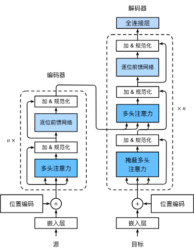

**本质**：一个完全基于 **Attention（注意力机制）** 的 **Seq2Seq（序列到序列）** 模型。抛弃了循环（Recurrence）和卷积（Convolution）


## 架构 

Transformer 依然沿用了 **Encoder-Decoder** 的经典结构，但内部组件发生了革命性变化。

### 1 整体结构

- **Encoder (编码器)**：由 $N$ 个（通常是 6 个）相同的层堆叠而成。负责深度理解输入序列（Source）。
    
- **Decoder (解码器)**：由 $N$ 个相同的层堆叠而成。负责根据 Encoder 的理解，自回归地生成输出序列（Target）。
    

### 2 输入层 (Input Layer)

由于模型没有循环结构，无法感知序列顺序，因此输入必须包含位置信息。

- **最终输入 = 词嵌入 (Word Embedding) + 位置编码 (Positional Encoding)**
- **操作方式**：**相加 (Element-wise Addition)**，而非拼接。


##  核心组件

### 1 编码器层

每个 Encoder Block 包含两个子层：
1. **多头自注意力 (Multi-Head Self-Attention)**
    - **作用**：让词与词之间建立联系，捕捉长距离依赖和上下文语义（如指代消解）。
    - **来源**：$Q, K, V$ 全部来自上一层的输出（自己查自己）。
2. **前馈神经网络 (Position-wise FFN)**
    - **作用**：两层全连接网络（ReLU激活），对提取的特征进行非线性变换和加工。
    - **结构**：Linear -> ReLU -> Linear。

> 通用机制：Add & Norm
> 每个子层后都接了：残差连接 (Residual Connection) + 层归一化 (Layer Normalization)。
> 公式：$LayerNorm(x + Sublayer(x))$。目的是防止梯度消失，加速收敛。

### 3.2 Decoder Layer (解码器层)

Decoder 比 Encoder 多了一个子层，共有三个：

1. **掩蔽多头自注意力 (Masked Multi-Head Self-Attention)**
    
    - **关键点**：**Masked (掩蔽)**。
        
    - **作用**：在预测当前词时，将“未来的词”遮挡住（设为 $-\infty$），防止模型作弊。保证模型只能看到当前及之前的词。
        
2. **交互注意力 (Cross-Attention / Encoder-Decoder Attention)**
    
    - **关键点**：连接 Encoder 和 Decoder 的桥梁。
        
    - **Query ($Q$)**：来自 **Decoder**（当前生成状态）。
        
    - **Key ($K$) & Value ($V$)**：来自 **Encoder 的最终输出**（源句子的完整记忆）。
        
    - **作用**：Decoder 每生成一步，都要回头去 Encoder 的记忆库里查阅相关信息。
        
3. **前馈神经网络 (FFN)**：同 Encoder。
    

---

## 4. 关键数据流转 (Data Flow)

以翻译任务（英译中）为例：

### 阶段一：Encoder (理解)

1. 输入英文句子向量（含位置编码）。
    
2. 经过 $N$ 层 Self-Attention 和 FFN 的反复提炼。
    
3. **产出**：一组高维向量矩阵 $Memory$（包含整句话的语义精髓），作为 $K$ 和 $V$ 输送给 Decoder。
    

### 阶段二：Decoder (生成)

1. 输入 `<SOS>`（起始符）。
    
2. **Masked Self-Attention**：处理已生成的词（此时只有 `<SOS>`）。
    
3. **Cross-Attention**：
    
    - 拿 `<SOS>` 的向量当 $Q$。
        
    - 去 Encoder 的 $Memory$ ($K, V$) 里查询。
        
    - 找到最匹配的词（比如 Source 中的第一个词）。
        
4. **FFN & Linear**：处理信息。
    
5. **Softmax**：预测第一个字（如“我”）。
    
6. **循环**：将“我”加入输入，重复上述步骤，直到生成 `<EOS>`。
    

---

## 5. Transformer vs. RNN

|**维度**|**RNN / LSTM**|**Transformer**|**优势说明**|
|---|---|---|---|
|**并行计算**|**无** (串行，$t$ 依赖 $t-1$)|**有** (整个序列一次性输入)|训练速度大幅提升，利用 GPU 并行能力。|
|**长距离依赖**|**弱** (距离越远信息越淡)|**强** (任意两词距离恒为 1)|彻底解决“遗忘”问题，能理解长文本。|
|**信息瓶颈**|有 (Context Vector 固定长度)|无 (Attention 动态关注)|避免了压缩带来的信息损失。|
|**位置信息**|隐式包含 (按顺序读)|**显式注入 (Positional Encoding)**|需要额外加入正弦/余弦编码。|

---

## 6. 面试/考试必记考点

1. **为什么 Decoder 需要 Mask？**
    
    - 因为训练时是并行的，为了模拟推理时的“不可见未来”，必须掩盖掉当前位置之后的词，保持自回归特性。
        
2. **Cross-Attention 中的 Q, K, V 分别来自哪里？**
    
    - $Q$ 来自 Decoder（上一层输出）。
        
    - $K, V$ 来自 Encoder（最后一层输出）。
        
3. **为什么位置编码用相加而不是拼接？**
    
    - 在高维空间中，相加足以保留两种信息，且不增加维度（参数量）。
        
4. **多头注意力的计算量比单头大吗？**
    
    - 不大。因为每个头的维度 $d_k = d_{model} / h$，总计算量基本持平。
        

---

## 7. PyTorch 代码骨架 (伪代码)

Python

```
class Transformer(nn.Module):
    def __init__(self, ...):
        # 1. 词嵌入 + 位置编码
        self.embedding = nn.Embedding(...)
        self.pos_encoder = PositionalEncoding(...)
        
        # 2. 核心结构
        self.transformer = nn.Transformer(
            d_model=512, 
            nhead=8, 
            num_encoder_layers=6, 
            num_decoder_layers=6
        )
        
        # 3. 输出层
        self.fc_out = nn.Linear(512, vocab_size)

    def forward(self, src, tgt):
        # src: [seq_len, batch_size]
        # tgt: [seq_len, batch_size]
        
        # 预处理
        src = self.pos_encoder(self.embedding(src))
        tgt = self.pos_encoder(self.embedding(tgt))
        
        # 生成 Mask (关键步骤)
        # tgt_mask: 用于遮挡未来信息
        tgt_mask = self.transformer.generate_square_subsequent_mask(len(tgt))
        
        # 经过 Transformer 核心
        # 内部会自动处理 Encoder -> Decoder 的 Cross Attention
        out = self.transformer(src, tgt, tgt_mask=tgt_mask)
        
        return self.fc_out(out)
```