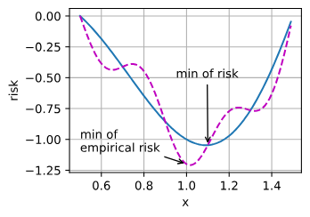
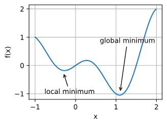
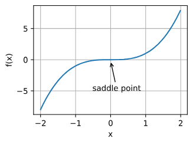

## 优化
在优化中，损失函数通常被称为优化问题的**目标函数**
大多数优化算法都关注的是最小化
如果我们需要最大化目标，那么有一个简单的解决方案：在目标函数前加负号即可
## 优化的目标
1. 优化的目标：最小化目标函数，减少训练误差
2. 深度学习的目标：在给定有限数据量的情况下寻找合适的模型，减少泛化误差（注意过拟合）

风险：整个数据群的预期损失
经验风险：训练数据集的平均损失

## 深度学习中的优化挑战
在深度学习中，大多数目标函数都很复杂，没有解析解，必须使用数值优化算法
### 1. 局部最小值

深度学习模型的目标函数通常有许多**局部最优解**
噪声：小批量上梯度的自然变化能够将参数从局部极小值中跳出。

### 2. 鞍点
_鞍点_是指函数的所有梯度都消失但既不是全局最小值也不是局部最小值的任何位置

我们假设函数的输入是k维向量，其输出是标量，因此其Hessian矩阵（也称黑塞矩阵）将有k个特征值
- 当函数在零梯度位置处的Hessian矩阵的特征值**全部为正值**时，我们有该函数的**局部最小值；**
- 当函数在零梯度位置处的Hessian矩阵的特征值**全部为负值**时，我们有该函数的**局部最大值**；
- 当函数在零梯度位置处的Hessian矩阵的特征值**为负值和正值**时，我们有该函数的一个**鞍点**。

凸函数：简而言之，凸函数是Hessian函数的特征值永远不为负值的函数。

### 3. 梯度消失

假设我们想最小化函数$f(x) = \tanh(x)$，然后我们恰好从x=4开始。正如我们所看到的那样，f的梯度接近零。更具体地说，$f'(x) = 1 - \tanh^2(x)$，因此是$f'(4) = 0.0013$。因此，在我们取得进展之前，优化将会停滞很长一段时间。