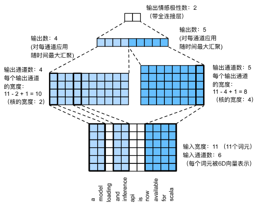

# TextCNN 文本卷积神经网络

## 1. 核心思想 (Core Idea)

- **将文本视为图像**：将一句话看作一个二维矩阵 `(Seq_Len, Embed_Dim)`。
    
- **捕捉局部特征 (N-gram)**：利用卷积核提取关键词组（如 "very good", "not bad"）。
    
- **时序最大池化**：利用 Max Pooling 解决文本变长问题，并提取最显著的情感特征。
    

## 2. 架构流程 (Architecture Breakdown)

_基于上传图片中的示例数据：句子长度 11，词向量维度 6_

### 第一层：输入层 (Input/Embedding)

- **输入**：形状为 `(Batch, Seq_Len=11, Embed_Dim=6)` 的张量。
    
- **视觉化**：可以把它想象成一张高度为 11、宽度为 6 的“单通道灰度图”。
    
- **约束**：卷积核的**宽度**必须与词向量维度（6）一致，因此卷积核只能在**高度**（时间步）方向移动。
    

### 第二层：卷积层 (1D Convolution)

TextCNN 的精髓在于**并行使用不同尺寸的卷积核**。

- **分支 A (图中左侧)**：
    
    - **核尺寸 (Kernel Size)**：`2` (覆盖 2 个单词，捕捉 2-gram)。
        
    - **通道数 (Channels)**：`4` (意味着有 4 个不同的探测器)。
        
    - **输出形状**：高度变为 $11 - 2 + 1 = 10$。输出张量形状 `(Batch, 4, 10, 1)`。
        
- **分支 B (图中右侧)**：
    
    - **核尺寸 (Kernel Size)**：`4` (覆盖 4 个单词，捕捉 4-gram)。
        
    - **通道数 (Channels)**：`5` (意味着有 5 个不同的探测器)。
        
    - **输出形状**：高度变为 $11 - 4 + 1 = 8$。输出张量形状 `(Batch, 5, 8, 1)`。
        

### 第三层：时序最大汇聚层 (Max-Over-Time Pooling)

- **操作**：对每个通道生成的特征图（Feature Map），在时间维度上取最大值。
    
- **目的**：
    
    1. **降维**：将变长的序列（长度 10 或 8）压缩为 1 个数值。
        
    2. **特征提取**：不管关键词出现在句首还是句尾，只保留“最强信号”。
        
- **结果**：
    
    - 左侧分支：得到 `4` 个标量。
        
    - 右侧分支：得到 `5` 个标量。
        

### 第四层：全连接输出层 (FC & Output)

- **拼接 (Concatenate)**：将所有分支的池化结果拼在一起。
    
    - 总特征向量长度 = $4 + 5 = 9$。
        
- **分类**：输入全连接层，映射到类别空间（如 2 类：Pos/Neg）。
    
- **Dropout**：通常在拼接后、FC 前使用，防止过拟合。
    

## 3. 关键知识点 (Key Takeaways for Exam/Project)

|**概念**|**TextCNN 特性**|**对比 CV 中的 CNN**|
|---|---|---|
|**卷积维度**|**1D 卷积** (仅在时间轴滑动)|**2D 卷积** (在高和宽方向滑动)|
|**核宽度**|**必须等于 Embedding 维度**|可以在宽度上小于图像宽度|
|**多核尺寸**|**必须** (同时用 3, 4, 5 等不同高度)|通常每一层只用一种尺寸 (如 3x3)|
|**池化方式**|**Global Max Pooling** (取整句最大)|Local Max Pooling (取 2x2 区域最大)|
|**位置信息**|**丢失** (池化后不知道词在哪)|保留 (池化后知道大致区域)|

## 4. 为什么 TextCNN 适合情感分析？

1. **并行计算快**：卷积操作可以并行化（不需要像 RNN 那样等上一个词算完），训练速度极快。
    
2. **抓关键词**：情感往往由少数几个形容词（"great", "awful"）决定，Max Pooling 能精准抓住这些强信号。
    
3. **甚至优于 RNN**：在简单的分类任务上，TextCNN 往往能取得和 LSTM 差不多甚至更好的效果，且算力消耗更低。