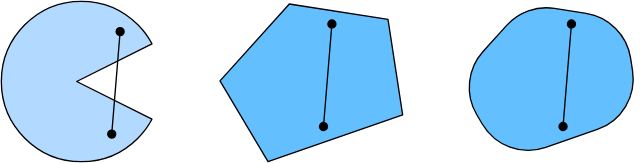
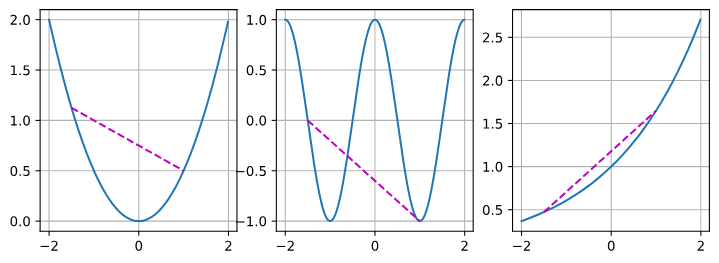

## 为什么要学习凸性？

虽然深度神经网络中的优化问题通常是**非凸**的（Non-convex），但凸优化仍然非常重要，原因如下：

1. **理论基础**：它是研究非凸优化的基础，许多优化算法（如SGD）的收敛性证明依赖于凸性假设。
2. **特例存在**：在深度学习的某些子问题（如初始化、某些层的参数微调）或传统机器学习（如SVM、线性回归）中，问题本质是凸的。
3. **全局最优**：凸优化的核心优势在于**局部极小值即为全局极小值**。
## 凸集

### 定义

如果一个集合 $\mathcal{X}$ 中的任意两点 $x, y$ 的连线上的所有点仍然包含在 $\mathcal{X}$ 中，则称 $\mathcal{X}$ 为凸集。
数学表达：对于任意 $\lambda \in [0, 1]$，有：
$$\lambda x + (1-\lambda)y \in \mathcal{X}$$
### 性质

**交集**：两个凸集的交集仍然是凸集。
**并集**：两个凸集的并集**通常不是**凸集（例如两个分离的圆）。
### 凸函数
给定一个凸集$\mathcal{X}$，如果对于所有$x, x' \in \mathcal{X}$和所有$\lambda \in [0, 1]$，函数$f: \mathcal{X} \to \mathbb{R}$是凸的，我们可以得到

$$\lambda f(x) + (1-\lambda) f(x') \geq f(\lambda x + (1-\lambda) x').$$

_詹森不等式_:
$$\sum_i \alpha_i f(x_i)  \geq f\left(\sum_i \alpha_i x_i\right) \text{ and } E_X[f(X)] \geq f\left(E_X[X]\right),$$
换句话说：凸函数的期望不小于期望的凸函数

### 性质
1. 局部极小值是全局极小值
2. 凸函数的下水平集是凸的
3. 当一个函数的二阶导数存在时， 二阶导$\nabla^2f \succeq 0$

## 约束优化 

凸优化问题通常形式化为：
- **最小化**：$f(x)$ （$f$ 是凸函数）
- **约束条件**：
    - $g_i(x) \leq 0$ （$g_i$ 是凸函数）
        
    - $h_j(x) = 0$ （$h_j$ 必须是仿射函数/线性函数）
        

### 拉格朗日函数 

通过引入拉格朗日乘子，可以将约束优化转化为无约束问题。

$$L(x, \alpha) = f(x) + \sum \alpha_i g_i(x)$$

其中 $\alpha_i \geq 0$。

