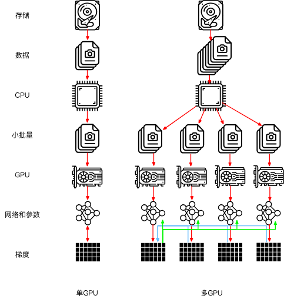
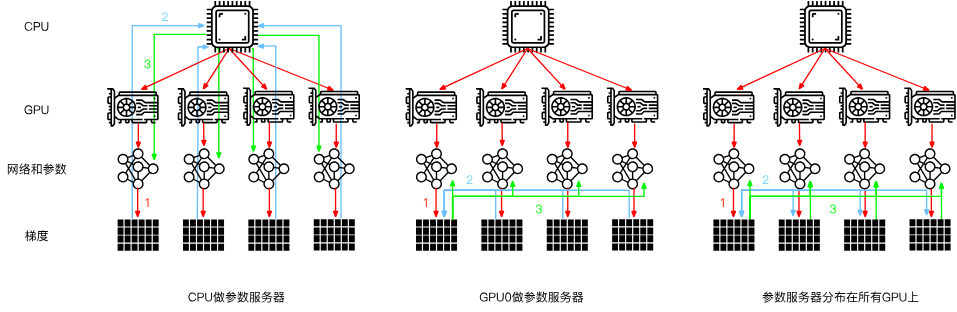

## 多机训练
1. 在每台机器上读取一组（不同的）批量数据，在多个GPU之间分割数据并传输到GPU的显存中。基于每个GPU上的批量数据分别计算预测和梯度。
    
2. 来自一台机器上的所有的本地GPU的梯度聚合在一个GPU上（或者在不同的GPU上聚合梯度的某些部分）。
    
3. 每台机器的梯度被发送到其本地CPU中。
    
4. 所有的CPU将梯度发送到中央参数服务器中，由该服务器聚合所有梯度。
    
5. 然后使用聚合后的梯度来更新参数，并将更新后的参数广播回各个CPU中。
    
6. 更新后的参数信息发送到本地一个（或多个）GPU中。
    
7. 所有GPU上的参数更新完成。