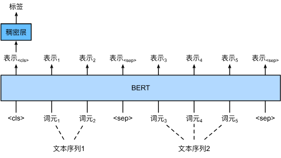
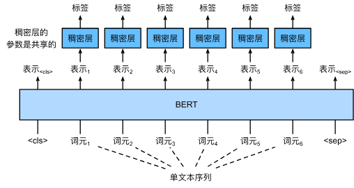
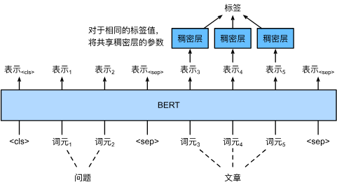

## 1. 核心范式 (The Paradigm)

- **输入**：特定任务的文本序列（单句或句对），经过 BERT 编码。
    
- **模型**：加载预训练好的 BERT 参数（如 BERT-Base, 768维），后续接一个简单的全连接层（MLP）。
    
- **训练**：端到端微调。不仅更新最后的输出层参数，也会**反向传播更新 BERT 内部的所有参数**。
    
- **关键点**：针对不同任务，主要区别在于**取 BERT 输出的哪一部分**向量。
    

## 2. 序列级应用 (Sequence-Level Applications)

这类任务关注**整句话**或**整个句子对**的宏观语义。

### 2.1 典型任务

- **单句分类**：情感分析（判断整句是褒/贬）、文本分类（新闻分类）。
    
- **句子对分类**：自然语言推断 (NLI)（判断两句话是蕴涵/矛盾/中立）、语义相似度。
    

### 2.2 架构细节

1. **输入构造**：
    
    - 单句：`[CLS] 句子 [SEP]`
        
    - 句对：`[CLS] 前提 [SEP] 假设 [SEP]` (利用 Segment Embeddings 区分)
        
2. **特征提取**：
    
    - **只取 `[CLS]` 词元的输出向量** ($\mathbf{h}_\text{CLS}$)。
        
    - 原理：BERT 在预训练时被训练为用 `[CLS]` 聚合整个序列的上下文信息。
        
3. **输出层**：
    
    - 接一个全连接层：`Linear(hidden_size, num_classes)`。
        
    - 公式：$\hat{y} = \text{Softmax}(W \cdot \mathbf{h}_\text{CLS} + b)$。
        

---

## 3. 词元级应用 (Token-Level Applications)

这类任务关注句子中**每一个单词**的微观语义。

### 3.1 典型任务：序列标注 (Sequence Labeling)

- **词性标注 (POS)**：判断每个词是动词、名词等。
    
- **命名实体识别 (NER)**：识别句子中的人名、地名、机构名。
    

### 3.2 架构细节

1. **输入构造**：`[CLS] 句子 [SEP]`
    
2. **特征提取**：
    
    - **取所有词元的输出向量** $[\mathbf{h}_1, \mathbf{h}_2, \dots, \mathbf{h}_T]$。
        
    - 通常忽略 `[CLS]` 和 `[SEP]` 等特殊字符。
        
3. **输出层**：
    
    - 对**每一个位置**的向量 $\mathbf{h}_i$ 使用**同一个**全连接层进行分类。
        
    - 输出维度 = 标签类别数（如 NER 中的 B-PER, I-PER, O 等）。
        

---

## 4. 特殊词元级任务：问答系统 (SQuAD)

斯坦福问答数据集 (SQuAD) 也是词元级任务，但输出略有不同。

- **任务**：给定问题和文章，在文章中找出答案的**起始位置 (Start)** 和 **结束位置 (End)**。
    
- **输入**：`[CLS] 问题 [SEP] 文章 [SEP]`
    
- **输出层设计**：
    
    - 训练两个可学习的向量：$\mathbf{w}_{start}$ 和 $\mathbf{w}_{end}$。
        
    - **预测起点**：计算文章中每个词向量 $\mathbf{h}_i$ 与 $\mathbf{w}_{start}$ 的点积，Softmax 后概率最大的位置即为起点。
        
    - **预测终点**：计算文章中每个词向量 $\mathbf{h}_i$ 与 $\mathbf{w}_{end}$ 的点积，Softmax 后概率最大的位置即为终点。
        

---

## 5. 总结对比表 (Cheat Sheet)

|**特性**|**序列级应用 (Sequence-Level)**|**词元级应用 (Token-Level)**|
|---|---|---|
|**核心关注**|全局语义 (Global Context)|局部语义 (Local Context)|
|**使用向量**|**仅 `[CLS]` 向量**|**序列中每个 Token 的向量**|
|**典型案例**|情感分析、NLI、文本分类|NER、POS、SQuAD (问答)|
|**输出层**|1个分类器，处理 1 个向量|1个分类器，处理 N 个向量|
|**BERT 类名**|`BertForSequenceClassification`|`BertForTokenClassification` / `BertForQuestionAnswering`|

**复习建议**：

在 d2l 的代码练习中，重点观察模型 `forward` 函数中是如何切片 BERT 的输出 (`output`) 的：

- 如果代码写 `output[:, 0, :]`，那就是取第 0 个位置（`[CLS]`），这是序列级任务。
    
- 如果代码直接用 `output` 循环或映射，那就是词元级任务。
## 单文本分类

## 文本对分类或回归

## 文本标注

## 问答
