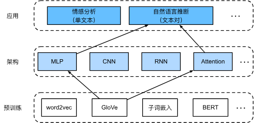

| **关系** | **英文**            | **定义**               | **例子**                              |
| ------ | ----------------- | -------------------- | ----------------------------------- |
| **蕴涵** | **Entailment**    | 如果前提为真，假设一定为真。       | **前**：两个人在踢足球。 **假**：两个人在做运动。    |
| **矛盾** | **Contradiction** | 如果前提为真，假设一定为假。       | **前**：两个人在踢足球。、 **假**：这两个人正坐着不动。 |
| **中立** | **Neutral**       | 假设可能为真，也可能为假（前提没提到）。 | **前**：两个人在踢足球。 **假**：这两个人是巴西人。   |

## 1. 核心背景与动机 (Motivation)

- **问题**：传统的 NLI 模型（如双塔 LSTM）依赖循环神经网络，计算不仅慢（无法并行），而且长距离依赖捕捉能力有限。
    
- **解决方案**：Parikh 等人 (2016) 提出了“可分解注意力模型”。
    
- **主要特点**：
    
    - **无循环/卷积层**：全模型由 MLP 和 Attention 构成。
        
    - **参数少且快**：训练速度比 LSTM 快很多，单 GPU 每秒可处理上万样本。
        
    - **分解技巧**：将注意力计算分解，将复杂度从 $O(mn)$ 降低到线性复杂度 $O(m+n)$（依赖于特定的分解实现方式，d2l 中主要强调其高效性）。
        

## 2. 模型架构：三步走 (The 3-Step Architecture)

模型输入为 **前提 (Premise, A)** 和 **假设 (Hypothesis, B)**。

整个流程分为三个清晰的步骤：**注意 (Attend)** $\rightarrow$ **比较 (Compare)** $\rightarrow$ **聚合 (Aggregate)**。

### 第一步：注意 (Attend) —— 软对齐

- **目标**：把句子 A 中的词和句子 B 中的语义相关词“对齐”。
    
- **输入**：
    
    - 前提 $A = (a_1, \dots, a_m)$
        
    - 假设 $B = (b_1, \dots, b_n)$
        
- **计算注意力分数**：
    
    通过一个 MLP $f$ 变换词向量，然后计算点积：
    
    $$e_{ij} = f(a_i)^\top f(b_j)$$
    
- **生成对齐向量 (Soft Alignment)**：
    
    - **$\beta_i$ (B 对齐到 A)**：A 中第 $i$ 个词 $a_i$ 对应的 B 的加权平均（即 $a_i$ 在 B 中的“替身”）。
        
        $$\beta_i = \sum_{j=1}^n \text{softmax}(e_{ij}) \cdot b_j$$
        
    - **$\alpha_j$ (A 对齐到 B)**：B 中第 $j$ 个词 $b_j$ 对应的 A 的加权平均。
        
        $$\alpha_j = \sum_{i=1}^m \text{softmax}(e_{ij}) \cdot a_i$$
        
- **代码实现**：定义 `Attend` 类，输出 $\beta$ (shape: `batch, seq_len_a, embed_dim`) 和 $\alpha$。
    

### 第二步：比较 (Compare) —— 局部特征提取

- **目标**：将“原词”和它的“替身”放在一起比较，判断局部逻辑关系（如：蕴涵、矛盾）。
    
- **操作**：
    
    将词向量与对齐向量拼接，送入另一个 MLP $g$：
    
    - **比较 A 侧**：$v_{A,i} = g([a_i, \beta_i])$
        
    - **比较 B 侧**：$v_{B,j} = g([b_j, \alpha_j])$
        
- **直观理解**：如果 $a_i$ 是“足球”，$\beta_i$ 是“运动”，$g$ 函数会识别出这是一种“蕴涵”关系。
    

### 第三步：聚合 (Aggregate) —— 全局推断

- **目标**：汇总所有局部比较结果，进行最终分类。
    
- **操作**：
    
    1. **求和汇聚 (Sum Pooling)**：
        
        $$v_A = \sum_{i=1}^m v_{A,i}, \quad v_B = \sum_{j=1}^n v_{B,j}$$
        
    2. **分类**：
        
        将 $v_A$ 和 $v_B$ 拼接，送入分类 MLP $h$：
        
        $$\hat{y} = h([v_A, v_B])$$
        
- **输出**：3分类概率（Entailment, Contradiction, Neutral）。
    

## 3. 实现细节 (Implementation Details)

- **预训练词向量**：必须使用。d2l 使用了 **GloVe (100维)**。因为模型本身没有复杂的特征提取器，高度依赖词嵌入的语义质量。
    
- **MLP 结构**：
    
    - `mlp` 函数通常包含：`Linear` -> `ReLU` -> `Linear` -> `ReLU` ...
        
    - d2l 中设定隐藏层维度为 **200**。
        
- **序列长度**：统一填充/截断到 **50**。
    
- **Dropout**：为了防止过拟合，通常在 MLP 层间加入 Dropout。
    

## 4. 训练与评估 (Training & Evaluation)

- **数据集**：SNLI (Stanford Natural Language Inference)。
    
    - 训练集：约 55 万条。
        
    - 测试集：约 1 万条。
        
- **超参数**：
    
    - Batch Size: 256
        
    - Optimizer: Adam
        
    - Learning Rate: 0.001 (通常需要较小，因为 GloVe 带来的梯度较大)
        
- **效果**：
    
    - 训练 4 轮后，测试集准确率可达 **82%** 左右。
        
    - 相比于复杂的 LSTM 模型，该模型训练极其迅速。
        

## 5. 易错点与思考 (Checklist)

1. **为什么没有 Position Embedding？**
    
    - 注意：这个原始版本的 Decomposable Attention Model **没有使用位置编码**。这意味着“我爱你”和“你爱我”在聚合阶段的结果可能是一样的（因为是求和）。这是一个已知的缺陷，但在 SNLI 数据集上影响不大，因为 NLI 主要考查词汇间的逻辑关系。
        
2. **$O(m+n)$ 复杂度是如何实现的？**
    
    - 在计算 $f(a_i)^T f(b_j)$ 时，如果不做优化，直接算注意力矩阵是 $O(mn)$。
        
    - 但在“注意”步骤前，我们可以先预先计算好所有 $f(a_i)$ 和 $f(b_j)$，这一步是 $O(m+n)$。当然，实际矩阵乘法计算注意力分数矩阵本质上还是涉及 $m \times n$ 的操作，这里的线性复杂度更多是指 MLP 的前向传播次数是线性的。
        
3. **对齐方向**：
    
    - 必须双向对齐（A对B，B对A），因为蕴涵关系是非对称的（“踢球”蕴涵“运动”，但“运动”不蕴涵“踢球”）。
        

