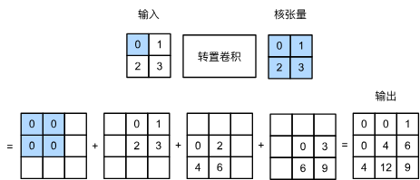

### 第一维度：直观视角 —— “广播”与“盖章”

普通卷积是“汇聚”（多变少），转置卷积是“广播”（少变多）。

#### 1. 核心操作逻辑

想象你在用**印章**。

- **输入元素**：每个像素值代表“按压印章的力度”。
    
- **卷积核 (Kernel)**：就是那个印章的花纹。
    
- **输出**：印章印在纸上的结果。
    

**具体过程：**

1. 取出输入特征图上的一个像素 $x$。
    
2. 用这个像素值 $x$ 去乘以整个卷积核 $K$（标量乘矩阵）。
    
3. 将这个结果“印”在输出张量的对应位置上。
    
4. **重叠相加 (Accumulate)**：不同位置的印章有重叠区域，重叠部分的数值要**相加**。
    

#### 2. 步幅 (Stride) 的逆向理解

在普通卷积中，Stride > 1 会导致跳过像素，使输出变小（下采样）。

在转置卷积中，Stride 是控制**“印章”之间隔多远盖一次**。

- 如果 $Stride = 2$，说明每隔一个像素盖一次章。
    
- 这会导致输出张量被极大地撑大，中间留出了空间，从而实现了**上采样**。
    

### 第二维度：数学视角 —— 矩阵转置 

这解释了为什么它叫“转置”卷积，而不是“反”卷积（Deconvolution）。

#### 1. 卷积 = 稀疏矩阵乘法

假设我们将输入图像 $X$ 展平为一个列向量 $x$，输出展平为 $y$。

普通卷积运算可以表示为一个巨大的稀疏矩阵 $C$ 与 $x$ 相乘：

$$y = C \cdot x$$

- 这个矩阵 $C$ 大部分元素是 0，非 0 元素来源于卷积核的权重。
    
- 如果输入是 4，输出是 2，那么 $C$ 的形状是 $2 \times 4$。
    

#### 2. 转置卷积 = 乘以后向传播的矩阵

如果我们想从 2 维变回 4 维，数学上最直接的方法是乘以 $C$ 的转置矩阵 $C^T$（形状 $4 \times 2$）：

$$z = C^T \cdot y$$

- **核心结论：** 转置卷积**并不是**在数值上求卷积的逆（$C^{-1}$，那是数学上的反卷积，极其不稳定），而是在**形状上**做逆运算。
    
- 它复用了卷积运算的梯度反向传播逻辑（因为卷积的反向传播刚好就是乘 $W^T$）。
    

---

### 第三维度：参数陷阱 —— 填充与形状恢复

这是 d2l 中最容易让人晕的地方，特别是 **Padding** 的行为。

#### 1. 形状的可逆性 (Shape Reversibility)

转置卷积设计的初衷，是为了让形状“还原”。

- **普通卷积：** $Input (32) \xrightarrow{k=3, p=1, s=2} Output (16)$
    
- **转置卷积：** 只要设置**完全相同**的参数 ($k=3, p=1, s=2$)，它就能：$Input (16) \xrightarrow{Transposed} Output (32)$
    

#### 2. Padding 的“反常”行为

- **普通卷积的 Padding**：在**输入**周围补 0。
    
- **转置卷积的 Padding**：在**输出**周围**切除 (Crop)** 像素。
    
    - _为什么？_ 因为在普通卷积中，Padding 的存在是为了让输出不要缩得太小。那么在逆运算（转置卷积）中，我们需要把当初为了维持大小而多出来的部分“切掉”，才能完美还原回原来的尺寸。
        

### 💡 针对笔记中练习题的深度解析

你整理的练习题非常切中要害，这里给出详细答案：

#### 练习 1：卷积输入 $X$ 与转置卷积输出 $Z$ 形状相同，但数值是否相同？

**答案：完全不同。**

- **原因：** 卷积（下采样）是一个**信息丢失**的过程。比如 $2 \times 2$ 的 Max Pooling 变成 1 个值，你丢掉了 3/4 的信息。
    
- 转置卷积只能恢复**形状 (Shape)**，无法恢复**内容 (Content)**。
    
- 它生成的“细节”是网络通过学习权重自己“脑补”出来的，而不是原图真实的细节。这也是为什么早期的 FCN 生成的边缘比较模糊的原因。
    

#### 练习 2：用矩阵乘法实现卷积是否高效？

**答案：非常低效。**

- **空间复杂度爆炸：** 那个稀疏矩阵 $W$ 极其巨大。
    
    - 假设输入图片 $1024 \times 1024$，矩阵的列数就是 $10^6$。构建这个显式矩阵会瞬间撑爆内存。
        
- **实际实现 (im2col + GEMM)：**
    
    - 在底层（如 cuDNN），卷积通常是通过 `im2col`（将滑窗区域展平成列）操作，转化成紧凑的矩阵乘法 (GEMM)，而不是构建那个巨大的稀疏矩阵。
        
    - 转置卷积在底层通常被视为**“对梯度的卷积”**来实现，或者使用专门优化过的 Kernel。
        

### 总结

1. **功能**：用于语义分割的上采样，把小特征图变大。
    
2. **直观**：像投影仪一样，把一个像素的信息“广播”到一片区域，重叠处相加。
    
3. **本质**：数学上是 $y = W^T x$，是卷积运算的矩阵转置，只恢复形状，不恢复原始数值。