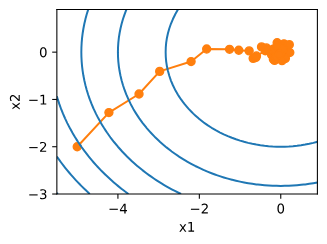

**梯度下降法**每次迭代需计算所有样本梯度，代价为O(n)，样本量大时效率极低
**SGD核心改进**:每次迭代随机采样 1 个样本i，用该样本的梯度∇fi​(x)替代完整梯度更新参数
更新公式为：x←x−η∇fi​(x)，其中η为学习率。

结果显示：SGD 参数更新轨迹比梯度下降更 “嘈杂”，即使迭代 50 次也难接近最优解(0,0)，核心问题在于固定学习率的局限性。
##  动态学习率
- 学习率太小：初期参数更新缓慢，难有有效进展；
- 学习率太大：后期难以收敛到最优解，
- 需通过**动态调整学习率**（η(t)，t为迭代次数）平衡效率与收敛性。
常见形式:
$$\begin{split}\begin{aligned}
    \eta(t) & = \eta_i \text{ if } t_i \leq t \leq t_{i+1}  && \text{分段常数} \\
    \eta(t) & = \eta_0 \cdot e^{-\lambda t} && \text{指数衰减} \\
    \eta(t) & = \eta_0 \cdot (\beta t + 1)^{-\alpha} && \text{多项式衰减}
\end{aligned}\end{split}$$

这往往会导致算法收敛之前过早停

### 一、先搞懂：随机梯度下降（SGD）到底是 “干什么的”？

咱们先打个比方：假设你在一座大雾弥漫的山上，想尽快走到山底（找到模型的最优解，即损失函数最小的位置）。但你看不清全貌，只能根据脚下的坡度（梯度）判断方向 —— 坡度最陡的方向，就是下山最快的方向（梯度负方向，因为梯度指向 “上坡”，负方向才是 “下坡”）。

在深度学习里，“山” 就是**损失函数**（用来衡量模型预测值和真实值差距的函数），“你的位置” 就是**模型参数**（权重、偏置等），“下山” 就是通过调整参数减小损失的过程。而**随机梯度下降（SGD）**，就是 “下山” 时最基础、最常用的 “找路方法”—— 它每次只看 “脚下一小块地方的坡度”（随机选一个样本计算梯度），就调整一步方向，逐步靠近山底。

简单说：SGD 的核心是 “**随机选一个样本算梯度，用这个梯度更新参数**”，目的是高效找到让模型预测最准的参数。

### 二、为什么需要 “随机”？先从 “原始梯度下降” 说起

在理解 SGD 之前，得先知道它的 “前辈”——**批量梯度下降（BGD，Batch Gradient Descent）**，这样才能明白 “随机” 的价值。

#### 1. 批量梯度下降（BGD）：“看全貌再下山”，准确但慢

批量梯度下降的逻辑很 “稳妥”：每次下山前，先走遍 “当前位置周围所有地方”（用**全部训练样本**计算梯度），算出 “全局最陡的坡度”，再朝这个方向走一步。

- 优点：因为用了所有样本，梯度计算很准确，能稳步朝着山底走，不容易走偏。

- 致命缺点：太慢！如果训练样本有 100 万条（比如 ImageNet 数据集有 120 万张图片），每次更新参数都要遍历 100 万样本，计算量巨大，电脑根本扛不住，而且模型训练周期会拖得特别长（可能几天甚至几周才能更一次参数）。

#### 2. 随机梯度下降（SGD）：“看一步走一步”，快但有点晃

SGD 正是为了解决 BGD 的 “慢” 而诞生的：它每次不看全部样本，只**随机选 1 个样本**，用这个样本计算的梯度来更新参数。

- 举个例子：如果有 100 万样本，BGD 每次要算 100 万次梯度才能更一次参数；而 SGD 每次算 1 个样本的梯度就更新，100 万样本能更新 100 万次参数，效率直接提升 100 万倍！

- 为什么 “随机”？如果每次都按固定顺序选样本（比如每次都选第 1 个），模型会 “记住” 这个样本的规律，导致泛化能力变差（比如只学好了第 1 个样本，其他样本预测不准）。随机选样本能让模型看到 “多样化的坡度”，避免学偏，更接近真实的下山方向。

### 三、SGD 的核心原理：“三步循环” 走到底

SGD 的训练过程就像一个 “循环小游戏”，重复三个步骤，直到走到山底（损失不再下降）：

#### 步骤 1：随机选一个样本

从训练集中 “随便抽” 1 个样本（比如一张图片、一条文本数据），记为（x_i, y_i），其中 x_i 是输入（比如图片像素），y_i 是真实标签（比如 “猫” 的标签）。

#### 步骤 2：算梯度（看坡度）

用这个样本计算 “当前参数下的损失” 和 “损失对参数的梯度”：

- 先让模型用当前参数对 x_i 做预测，得到预测值 y_hat；

- 计算损失（比如用均方误差：损失 = (y_hat - y_i)²，差距越大损失越大）；

- 求梯度：计算 “损失函数对每个参数的导数”—— 比如参数 w 的梯度∂损失 /∂w，这个梯度告诉我们：“w 稍微变大一点，损失会变多还是变少？变多少？”

举个简单例子：如果∂损失 /∂w = 5，说明 w 每增加 1，损失就增加 5，那要减小损失，w 就该 “往反方向走”（即减少）。

#### 步骤 3：更新参数（朝下坡走一步）

根据梯度调整参数，公式很简单：

**新参数 = 旧参数 - 学习率 × 梯度**

这里的 “学习率（Learning Rate）” 是个关键[[超参数]]，相当于 “每次下山走的步长”：

- 步长太大（学习率 > 1）：可能一步跨过头，从山的这一侧直接跳到另一侧，甚至越跳越高（损失反而变大）；

- 步长太小（学习率 < 0.0001）：走得太慢，训练 100 万次还没靠近山底，浪费时间；

- 合适的步长（比如 0.01）：每次走一小步，稳步朝着山底靠近。

#### 循环：重复 1-3 步

把上面三步重复成千上万次，直到满足停止条件（比如循环次数达到预设值、损失连续 10 次不下降），训练就结束了。

### 四、SGD 的 “优缺点”：快是快，但有点 “晃”

#### 优点：简单、高效、省内存

1. **计算快**：每次只算 1 个样本的梯度，计算量小，适合大数据集（比如百万级、亿级样本）；

2. **省内存**：不需要存储所有样本的梯度，只需要存储当前样本的梯度，电脑内存压力小；

3. **能跳出局部最优**：因为梯度是 “随机的”，偶尔会出现 “往山上走一小步” 的情况，这反而能帮模型跳出 “小土坡”（局部最优解），找到真正的山底（全局最优解）。比如山底附近有个小坑，BGD 可能被困在坑里，但 SGD 的随机晃动能 “跳出来”。

#### 缺点：“步子晃”，收敛慢

1. **梯度不稳定**：因为只用 1 个样本算梯度，梯度可能 “不准”—— 比如这个样本是个 “异常值”（比如标签标错的图片），算出来的梯度是 “假坡度”，导致参数更新方向偏掉，损失曲线会 “上下波动”（比如一次更新损失降 0.5，下次又升 0.3）；

2. **收敛慢**：虽然更新次数多，但每次步长小且方向晃，要走到山底需要更多循环次数（比如 BGD 要 100 次循环，SGD 可能要 10000 次）。

### 五、SGD 的 “升级版”：解决 “晃” 的问题

为了弥补 SGD “晃” 的缺点，研究者提出了几个常用的改进版，其中最经典的是**小批量随机梯度下降（Mini-Batch SGD）**，现在实际应用中几乎都用它，而不是纯 SGD。

#### 小批量 SGD：“既不看全貌，也不只看一步”

它的逻辑是 “折中”：每次不选 1 个样本，也不选全部样本，而是选**一小批样本（比如 32 个、64 个、128 个）**，用这一批样本的 “平均梯度” 来更新参数。

- 优点：

1. 梯度更稳定：一批样本的平均梯度比单个样本的梯度更接近 “真实全局梯度”，损失曲线波动变小；

2. 效率高：电脑能对 “一批样本” 做并行计算（比如用 GPU 同时处理 32 张图片），比纯 SGD 更快；

- 常用批量大小：32、64、128（根据 GPU 内存选，内存大就选大一点的批量，比如 256；内存小就选 32）。

#### 其他升级版：带 “惯性” 的 SGD

除了小批量，还有两个常用改进能让 SGD “走得更稳”：

1. **动量法（Momentum）**：给 SGD 加 “惯性”，比如下山时如果之前一直朝左走，即使某次梯度让朝右走，也会 “带着惯性稍微朝左偏一点”，减少波动。原理是用 “过去几次梯度的平均值” 来更新参数，相当于 “记住之前的方向”；

2. **Adam 算法**：把动量法和 “自适应学习率” 结合，不仅有惯性，还能根据参数的梯度大小调整步长 —— 梯度大的参数步长小（避免跨过头），梯度小的参数步长稍大（加快速度），现在是深度学习中最常用的优化算法之一，但本质上还是基于 SGD 的改进。

### 六、SGD 的实际应用：避坑指南

用 SGD 训练模型时，有 3 个常见 “坑” 要避开：

#### 1. 学习率别乱设

- 千万别用默认学习率（比如框架默认 0.1）就直接训！最好从 0.001、0.01、0.1 三个值开始试，看哪个损失下降最快；

- 可以用 “学习率调度”：比如训练前 10 轮用 0.1，之后每 5 轮减半（0.05→0.025→0.01），避免后期步太大晃悠。

#### 2. 样本要打乱

每次训练前，一定要把训练集 “随机打乱”（比如每次循环都重新洗牌），否则模型会 “按顺序学样本”，导致泛化差。比如训练集按 “全是猫→全是狗” 排列，不打乱的话，模型前期只学猫，后期只学狗，最后两种动物都学不好。

#### 3. 数据要归一化

如果输入数据的尺度差异大（比如一个特征是 “年龄（0-100）”，另一个是 “收入（0-100000）”），会导致梯度 “一边大一边小”—— 收入的梯度可能是 10000，年龄的梯度是 1，更新时收入的参数跳得特别远，年龄的参数几乎不动。所以要先把数据归一化（比如都缩到 0-1 之间），让所有特征的梯度尺度差不多，SGD 才能走得稳。

### 七、一句话总结：SGD 是什么，什么时候用？

- **是什么**：SGD 是 “随机选 1 个样本算梯度，小步更新参数” 的下山方法，核心是 “快” 和 “避免学偏”；

- **什么时候用**：

1. 数据集大（百万级以上），BGD 算不动的时候；

2. 模型简单（比如线性回归、简单多层感知机），不需要太复杂优化的时候；

3. 实际中更常用 “小批量 SGD”（批量 32-128），兼顾速度和稳定性；

- **记住**：SGD 是所有优化算法的 “爸爸”，Adam、动量法等都是在它基础上改的，理解了 SGD，其他优化算法一看就懂！