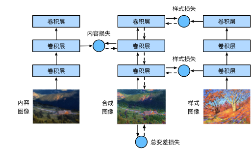

## 一、 核心思维：逆向优化

在之前的 CNN 训练中（如 ResNet, FCN），我们的公式是：

$$\min_{W} Loss(f(X; W), Y)$$

- **变量**：网络权重 $W$。
    
- **常量**：输入图像 $X$。
    

在风格迁移中，逻辑完全翻转：

$$\min_{X} Loss_{total}(X)$$
- **变量**：输入图像 $X$（通常初始化为内容图，然后不断修改其像素）。
    
- **常量**：网络权重 $W$（预训练好的 VGG-19，参数被锁死，不更新）。
    
> **一句话总结**：我们不是在训练网络去识别图片，而是在“训练”图片去匹配网络的特定激活模式。

## 二、 核心数学组件：损失函数构建

总损失函数由三部分组成，这也是算法的灵魂：

$$L_{total} = \alpha L_{content} + \beta L_{style} + \gamma L_{tv}$$

### 1. 内容损失 (Content Loss)

- **目的**：保证生成图 $X_{gen}$ 的物体轮廓、位置和 $X_{content}$ 一致。
    
- **计算位置**：VGG 的**深层**（如 `relu4_2`）。深层特征忽略像素细节，只关注语义结构。
    
- 公式：特征图 (Feature Map) 的均方误差 (MSE)。
    
    $$L_{content} = \frac{1}{2} \sum (F_{gen} - F_{content})^2$$
    

### 2. 风格损失 (Style Loss) —— 难点与核心

- **目的**：让生成图拥有 $X_{style}$ 的纹理、笔触、配色，但不关心这些纹理具体在哪。
    
- **计算位置**：VGG 的**多个层**（从浅层到深层）。浅层提取局部纹理（笔触），深层提取全局风格（色调布局）。
    
- **数学工具**：**Gram 矩阵 (Gram Matrix)**。
    
    - 假设某层输出特征图 $F$ 形状为 $(C, H, W)$。
        
    - 将其 Reshape 为 $(C, N)$，其中 $N=H \times W$。
        
    - **Gram 矩阵计算**：$G = F \cdot F^T$ （形状为 $C \times C$）。
        
- **CS/线性代数视角**：
    
    - $G_{ij}$ 是第 $i$ 个通道和第 $j$ 个通道的**内积**。
        
    - 它衡量的是**特征之间的相关性 (Correlation)**。例如：当“检测竖线的通道”激活时，“检测蓝色的通道”是否也同时激活？
        
    - 因为对 $H \times W$ 求和了，所以它**丢弃了空间位置信息**，只保留了统计共现信息（即风格）。
        
- **公式**：两个 Gram 矩阵的 MSE。
    

### 3. 全变分损失 (Total Variation Loss, TV Loss)

- **目的**：工程上的去噪手段。生成的图片容易出现高频噪点。
    
- **公式**：$\sum |x_{i+1, j} - x_{i, j}| + |x_{i, j+1} - x_{i, j}|$
    
- **原理**：惩罚相邻像素的剧烈变化，强迫图片平滑。
    

## 三、 工程实现 

### 1. 预处理与后处理

- **预处理 (Preprocess)**：
    
    - 输入必须标准化（减去 ImageNet 的 RGB 均值，除以标准差）。
        
    - 因为 VGG 是在 ImageNet 上训练的，它对颜色分布极其敏感。
        
- **后处理 (Postprocess)**：
    
    - 输出时需要反向操作（乘以标准差，加上均值）。
        
    - **关键点**：需要 `Clip` 操作，把像素值强行限制在 $[0, 1]$ 之间，否则显示出来的图会出现奇怪的坏点。
        

### 2. 网络架构：VGG-19 的截取

- 我们不需要 VGG 的全连接层（分类头）。
    
- 我们只需要卷积层提取特征。
    
- **代码逻辑**：构建一个新的 `net`，包含从 Input 到 最后一层所需层（通常是 `relu5_1`）的所有层。在前向传播时，我们需要同时提取多个中间层的输出。
    

### 3. 初始化策略

- **冷启动**：虽然可以用白噪声初始化 $X_{gen}$，但收敛很慢。
    
- **热启动**：通常直接把 $X_{content}$ 赋值给 $X_{gen}$ 作为初始值。这样内容损失一开始就是 0，只需要优化风格。
    

### 4. 优化器选择

- 虽然 SGD 可用，但通常使用 **Adam** 或 **L-BFGS**。因为我们要优化的参数空间（一张图片的像素，约 $300 \times 450 \times 3 \approx 40$ 万参数）且 Loss 面非常崎岖。
    

## 四、 关键超参数 (Knobs to Turn)

在练习中，你可以调节这三个权重来改变输出效果：

|**权重参数**|**符号**|**调大时的效果**|**调小时的效果**|
|---|---|---|---|
|**`content_weight`**|$\alpha$|图片非常清晰，像原照片，风格不明显|内容崩坏，物体轮廓丢失|
|**`style_weight`**|$\beta$|艺术感极强，甚至变成抽象画|风格仅停留在色彩微调，像滤镜|
|**`tv_weight`**|$\gamma$|图片很糊，像涂抹过|图片噪点多，显得很脏|

**经验值**：通常 $\beta$ (风格权重) 会设得非常大（如 $10^3$ 或 $10^4$），因为 Gram 矩阵的值通常很小，需要放大 Loss 才能产生梯度。
